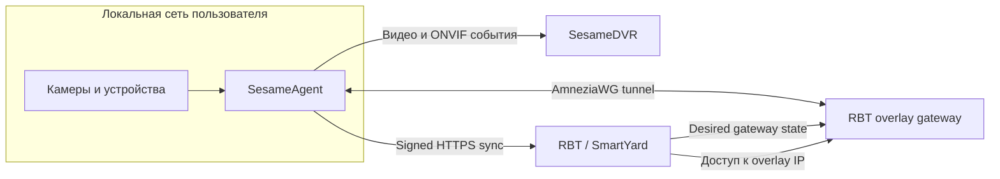
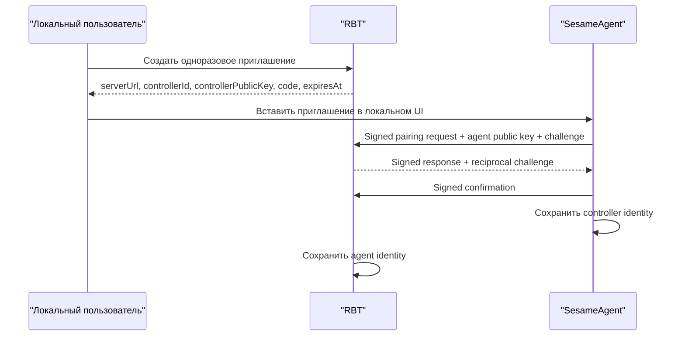
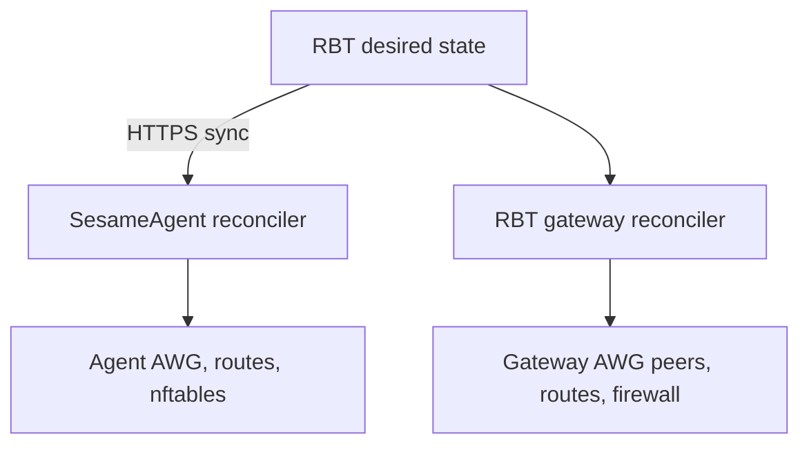

# Целевая модель SesameAgent, SesameDVR и RBT

## Статус документа

Этот документ фиксирует согласованную целевую архитектуру совместной работы:

- `SesameAgent` в локальной сети пользователя;
- `SesameDVR` как система приёма, хранения и воспроизведения видео;
- `RBT` (`rosteleset/SmartYard-Server`) как система управления объектами и сетевым доступом через overlay;
- RBT overlay gateway на базе AmneziaWG.

Документ описывает целевое состояние. Совместимость с ранним тестовым прототипом Agent не требуется. Его конфигурация и pairing переносятся вручную.

## 1. Основные принципы

1. Agent является владельцем своей локальной конфигурации, локальной сети, ключей и фактического состояния.
2. Agent сам инициирует все подключения к SesameDVR и RBT. Входящие соединения к Agent через NAT не требуются.
3. SesameDVR и RBT являются независимыми контроллерами с разными pairing, ключами, разрешениями и отзывом доступа.
4. Базовый pairing не даёт серверу права менять конфигурацию Agent.
5. Удалённое управление включается локальным пользователем Agent отдельно для каждого контроллера и только с явно заданными scopes.
6. RBT хранит желаемое сетевое состояние, а Agent самостоятельно приводит локальную ОС к этому состоянию.
7. RBT не передаёт Agent низкоуровневые команды `ip`, `nft` или `awg`.
8. Persistent-конфигурация передаётся полным снимком desired state, а не очередью команд.
9. Одноразовые диагностические операции отделены от persistent-конфигурации.
10. Pairing привязан к application identity контроллера, а не к TLS-сертификату. Обычное обновление TLS-сертификата не сбрасывает pairing.

## 2. Компоненты и границы ответственности



### SesameAgent

Agent:

- хранит локальный список RTSP-потоков и ONVIF-устройств;
- сканирует локальную сеть только по команде локального пользователя либо при наличии отдельного managed scope;
- выполняет локальный repair потока и удаляет ненужные дорожки;
- шифрует и публикует разрешённые пользователем потоки в SesameDVR;
- публикует разрешённые ONVIF-события;
- генерирует и хранит device identity и private key AmneziaWG;
- применяет локальные интерфейсы, маршруты, 1:1 NAT и firewall;
- сверяет desired state с actual state и выполняет reconciliation;
- никогда не передаёт private keys контроллерам.

### SesameDVR

SesameDVR:

- принимает анонсы потоков и состояния Agent;
- выдаёт краткоживущие publish grants для разрешённых потоков;
- принимает, пишет и воспроизводит видео;
- принимает ONVIF-события;
- в базовом режиме не может включать, выключать, добавлять или менять локальные потоки Agent;
- может получить отдельное managed-разрешение на media-команды, если пользователь явно включил его на Agent;
- не управляет overlay, маршрутами и NAT RBT.

### RBT

RBT:

- выполняет отдельный pairing с Agent;
- хранит desired state overlay и mappings;
- выделяет tunnel IP, overlay prefix и overlay IP;
- показывает администратору состояние Agent, overlay и mappings;
- передаёт Agent полный signed desired state во время короткого HTTPS sync;
- не выполняет команды в локальной ОС Agent;
- не меняет RTSP, media repair, шифрование и публикацию потоков;
- не получает media publish secrets SesameDVR.

### RBT overlay gateway

Gateway:

- принимает AmneziaWG-соединения Agent;
- применяет server-side peers, `AllowedIPs`, маршруты и firewall;
- предоставляет RBT доступ к выделенным overlay IP;
- согласует server-side состояние с desired state в PostgreSQL RBT;
- не управляет локальной ОС Agent и не хранит его private key.

Если gateway работает на сервере RBT, server-side изменения выполняет отдельный минимально привилегированный сервис `rbt-overlay-gateway` с `CAP_NET_ADMIN`. Если используется внешний gateway, тот же desired state передаётся его контроллеру через отдельный API.

## 3. Два уровня доверия

### 3.1. Base pairing

Base pairing устанавливает взаимное доверие Agent и конкретного контроллера, но не разрешает контроллеру менять конфигурацию Agent.

После base pairing контроллер может:

- принимать identity, capabilities, inventory и health Agent;
- принимать анонсы разрешённых локальным пользователем потоков и событий;
- выдавать publish grants или показать доступность сервисов;
- принимать health и диагностическую телеметрию, которую Agent сам включил в анонс.

Он не может:

- добавить или удалить камеру;
- запустить или остановить поток;
- изменить шифрование;
- изменить overlay или mapping;
- запустить сканирование LAN;
- изменить локально разрешённые диапазоны сети.

### 3.2. Managed authorization

Managed authorization выдаётся отдельно после base pairing.

Локальный пользователь Agent:

1. выбирает доверенный controller;
2. включает удалённое управление;
3. выбирает разрешённые scopes;
4. генерирует одноразовый высокоэнтропийный managed secret;
5. передаёт secret администратору соответствующего controller по отдельному каналу.

Controller доказывает знание secret через challenge-response. После проверки Agent создаёт managed grant, привязанный к public key этого controller. Одноразовый secret больше не используется.

Agent остаётся инициатором соединения и на этом шаге. Администратор вводит secret в UI RBT, RBT возвращает подписанное доказательство в очередном `sync`, а Agent подтверждает создание grant в следующем `sync`. Входящий запрос к Agent не требуется.

Для RBT предусмотрены scopes:

- `overlay.configure`;
- `mapping.configure`;
- `network.diagnose`;
- `lan.scan`, только как отдельное явное разрешение.

Scopes SesameDVR управляются независимо и не дают RBT дополнительных прав.

Локальный пользователь может отозвать managed grant, не удаляя base pairing. Полный revoke удаляет и pairing, и все grants соответствующего controller.

## 4. Identity, pairing и защита протокола

### 4.1. Постоянные identity

Agent при первом запуске генерирует:

- стабильный случайный `agentId`;
- Ed25519 device key pair;
- локальный key encryption key для защиты секретов на диске.

Каждый controller имеет собственные `controllerId` и Ed25519 key pair.

### 4.2. Pairing flow



Pairing invitation:

- одноразовое;
- имеет короткий TTL;
- содержит identity RBT и его application public key;
- не содержит постоянных private secrets;
- становится недействительным сразу после успешного использования.

### 4.3. TLS и application identity

HTTPS проверяется обычным способом через системную CA chain и hostname. Дополнительно каждый запрос и ответ подписывается application key.

Agent хранит `controllerId` и application public key RBT. Он не хранит TLS fingerprint как identity контроллера. Поэтому замена или продление корректного TLS-сертификата не влияет на pairing.

Изменение application key требует явной key rotation либо нового pairing.

### 4.4. Signed requests

Каждый запрос Agent содержит:

- `agentId`;
- `keyId`;
- UTC timestamp;
- уникальный `requestId`;
- монотонный `sequence`;
- hash canonical body;
- Ed25519 signature.

RBT проверяет подпись, допустимое окно времени, уникальность `requestId` и рост `sequence`. Ответ RBT подписывается controller key и проверяется Agent до разбора desired state.

Точный canonical payload, HTTP headers и общий Go/PHP test vector определены в [`http-protocol-v1.ru.md`](http-protocol-v1.ru.md).

## 5. Транспорт RBT - Agent

Для взаимодействия RBT с Agent используется короткоживущий HTTPS polling. Постоянный WSS-канал для этой задачи не требуется.

Целевые endpoints:

- `POST /rbt-agent/v1/pair`;
- `POST /rbt-agent/v1/pair/confirm`;
- `POST /rbt-agent/v1/sync`;
- `POST /rbt-agent/v1/actions/:id/result`;
- `POST /rbt-agent/v1/revoke`.

Managed authorization инициирует администратор через штатный защищённый admin
API SmartYard. Доказательство знания managed secret передаётся Agent внутри
подписанного ответа `sync`; отдельного публичного endpoint авторизации нет.

Endpoints обслуживаются отдельным Agent controller, а не обычной пользовательской сессией `frontend.php` SmartYard.

Рекомендуемый polling:

- 15-30 секунд с jitter в стабильном состоянии;
- 1-2 секунды после изменения desired state или незавершённого apply;
- exponential backoff при сетевой ошибке;
- немедленный sync после старта Agent или восстановления сети.

## 6. Declarative desired state

RBT не отправляет persistent-команды `overlay_apply`, `mapping_upsert`, `nft_add_rule` и подобные. Он возвращает полный снимок желаемого состояния.

Пример ответа `sync`:

```json
{
  "schemaVersion": 1,
  "desiredGeneration": 18,
  "desiredState": {
    "overlay": {
      "enabled": true,
      "type": "amneziawg",
      "endpoint": "rbt.example.com:51820",
      "serverPublicKey": "<public-key>",
      "tunnelAddress": "10.254.0.17/32",
      "overlayPrefix": "10.220.17.0/24",
      "allowedSourcePrefixes": [
        "10.10.0.0/16"
      ],
      "persistentKeepaliveSec": 25,
      "parameters": {}
    },
    "mappings": [
      {
        "id": "map-01J...",
        "localIp": "192.168.1.20",
        "overlayIp": "10.220.17.20",
        "enabled": true,
        "comment": "Подъезд 1"
      }
    ]
  },
  "actions": []
}
```

Agent применяет snapshot как единое желаемое состояние:

- mapping, отсутствующий в новом списке, должен быть удалён;
- duplicate local IP или overlay IP отклоняется;
- overlay IP обязан входить в выделенный Agent prefix;
- local IP обязан входить в диапазоны, локально разрешённые пользователем Agent;
- RBT не может расширить список локально разрешённых диапазонов;
- некорректный snapshot не применяется частично.

## 7. Reconciliation и фактическое состояние

Agent сообщает два поколения:

- `observedGeneration` - последнее desired generation, которое Agent получил и разобрал;
- `appliedGeneration` - generation, полностью и успешно применённое к системе.

Пример `sync` request:

```json
{
  "agentId": "agt-01J...",
  "observedGeneration": 18,
  "appliedGeneration": 17,
  "capabilities": {
    "overlayTypes": ["amneziawg"],
    "fullNat44": true,
    "lanScan": true
  },
  "actualState": {
    "overlay": {
      "state": "degraded",
      "interface": "awg-rbt",
      "lastHandshakeAt": null,
      "rxBytes": 0,
      "txBytes": 0
    },
    "mappings": [],
    "conditions": [
      {
        "type": "OverlayReady",
        "status": false,
        "reason": "HandshakeTimeout"
      }
    ]
  }
}
```

Алгоритм Agent:

1. проверить TLS, signature, timestamp, request ID и sequence ответа;
2. проверить managed grant и scopes;
3. проверить schema и локальную policy;
4. вычислить diff между actual и desired;
5. подготовить новую конфигурацию AWG, routes, NAT и firewall;
6. применить её атомарно;
7. проверить интерфейс, маршруты и правила;
8. записать новое локальное состояние;
9. обновить `appliedGeneration` только после полного успеха;
10. сообщить результат при следующем sync.

Если apply завершился ошибкой, `observedGeneration` может стать равным desired generation, но `appliedGeneration` остаётся прежним. Причина отражается в `conditions` и журнале.

## 8. Overlay и 1:1 NAT

### 8.1. Адресация

RBT выделяет каждому Agent:

- уникальный tunnel IP `/32`;
- уникальный overlay prefix, обычно `/24`;
- endpoint gateway;
- public key gateway;
- параметры AmneziaWG.

Agent самостоятельно генерирует AmneziaWG key pair. Private key никогда не покидает Agent. RBT получает только public key.

### 8.2. Mapping

Один mapping связывает один локальный IPv4 с одним уникальным overlay IPv4:

```text
192.168.1.20 <-> 10.220.17.20
```

Используется полный 1:1 NAT для всего IPv4:

- все TCP-порты;
- все UDP-порты;
- ICMP;
- прочие IPv4 protocols.

Модели `allowedPorts` нет. Ограничение доступа выполняется по source prefixes на overlay gateway и Agent firewall. По умолчанию overlay IP доступны только с доверенных сетей RBT.

Agent применяет:

- DNAT для трафика `overlayIp -> localIp`;
- SNAT для ответного трафика `localIp -> overlayIp` через overlay;
- source masquerade для входящего из overlay трафика на LAN-стороне, чтобы
  ответ камеры гарантированно возвращался через Agent, а не через обычный
  шлюз локальной сети;
- forwarding policy;
- маршруты;
- атомарный nftables ruleset.

Поэтому камера не требует отдельного статического маршрута к overlay prefix и
не видит исходный адрес RBT: для неё клиентом является LAN-адрес Agent. Это
осознанная часть L3 1:1 NAT. Если в будущем понадобится сохранять исходный IP,
это должен быть отдельный маршрутизируемый режим с явным return route в LAN.

Это L3-доступ, а не Ethernet bridge. Через overlay не проходят ARP, broadcast, multicast и WS-Discovery. Поиск ONVIF выполняет Agent локально, после чего передаёт inventory контроллерам в рамках разрешённой policy.

## 9. Server-side gateway reconciliation

Agent не может самостоятельно создать server-side AWG peer. Поэтому RBT overlay состоит из двух независимых reconciliation loops:



Gateway reconciler:

- получает только необходимую часть desired state;
- создаёт или обновляет peer по Agent public key;
- устанавливает `AllowedIPs` для tunnel IP и overlay prefix;
- применяет server-side routes и source firewall;
- публикует health, current generation и ошибки в RBT;
- не получает Agent private key и не выполняет команды внутри Agent.

## 10. Данные в PostgreSQL RBT

Целевая нормализованная модель:

### `edge_agents`

- identity и display name Agent;
- application public key и pairing status;
- managed scopes;
- capabilities;
- last seen;
- desired, observed и applied generations;
- краткое текущее health/condition summary.

### `edge_agent_pairing_invitations`

- одноразовый code hash;
- controller identity;
- TTL;
- статус использования;
- metadata инициировавшего администратора.

### `edge_overlay_pools`

- tunnel pool;
- overlay pool;
- размер prefix на Agent;
- policy allocation;
- gateway reference.

### `edge_overlay_leases`

- Agent;
- tunnel IP;
- overlay prefix;
- Agent AWG public key;
- gateway endpoint/public key;
- desired generation;
- enabled state.

### `edge_overlay_mappings`

- stable mapping ID;
- Agent ID;
- local IPv4;
- overlay IPv4;
- enabled;
- comment;
- desired generation;
- краткий current status.

### `edge_agent_actions`

Только ограниченная очередь одноразовых операций:

- diagnostics;
- LAN scan;
- inventory refresh;
- AWG key rotation.

Запись содержит `actionId`, type, payload, TTL, idempotency key, state и краткий result. Завершённые и failed actions удаляются через 1-7 дней. Queued и running actions не удаляются до завершения или истечения TTL.

Таблица `edge_agent_events` не создаётся. История событий хранится в ограничиваемых log files.

## 11. Связь с камерами RBT

Mapping является самостоятельной сетевой сущностью и не привязан к камере внешним ключом.

После создания mapping штатная камера RBT использует overlay IP напрямую:

```text
cameras.ip     = 10.220.17.20
cameras.url    = rtsp://10.220.17.20:554
cameras.stream = /stream1
```

Отдельная таблица `camera_edge_bindings` не нужна. Удаление камеры не удаляет mapping автоматически, потому что тот же overlay IP может использоваться для ONVIF, web UI, домофона или другого сервиса.

Операционное состояние overlay не хранится в `cameras.ext`. В форме камеры допустима только удобная UI-команда выбора существующего Agent mapping или создания нового. Результатом остаётся обычный IP/URL камеры.

## 12. UI RBT

### Глобальные настройки

Раздел `Настройки -> Agent Overlay`:

- включение подсистемы;
- public gateway endpoint;
- tunnel address pool;
- overlay address pool;
- размер prefix на Agent;
- AmneziaWG defaults;
- trusted source prefixes;
- polling defaults;
- gateway public key fingerprint;
- gateway health.

### Agent

Раздел `Агенты -> <Agent>` содержит вкладки:

- `Обзор`;
- `Overlay`;
- `Mappings`;
- `Устройства`;
- `Журнал`.

`Overlay` показывает:

- tunnel IP и overlay prefix;
- Agent AWG public key;
- gateway endpoint;
- desired, observed и applied generations;
- last handshake;
- RX/TX;
- conditions и ошибки.

`Mappings` показывает:

- local IP;
- overlay IP;
- enabled state;
- current apply state;
- comment;
- последнюю ошибку.

Форма mapping содержит только local IP, auto/manual overlay IP, enabled и comment. Полей портов нет.

Локально разрешённые LAN ranges Agent отображаются в RBT read-only. Изменить их можно только в локальном UI Agent.

## 13. Одноразовые actions

Persistent state не использует очередь команд. Очередь нужна только для операций, которые нельзя выразить желаемым состоянием.

Action:

- имеет уникальный `actionId`;
- подписан controller key;
- проверяется по managed scope;
- имеет TTL;
- выполняется идемпотентно;
- после reconnect не выполняется повторно, если Agent уже сохранил result;
- не может произвольно запускать shell-команду.

Agent поддерживает только закрытый allowlist типов actions и валидирует payload каждого типа.

## 14. Журналы

Детальная история не хранится в PostgreSQL.

Файлы RBT:

- `/var/log/rbt-agent-controller/events.jsonl`;
- `/var/log/rbt-overlay-gateway/events.jsonl`.

В них пишутся structured events:

- pairing и revoke;
- выдача и отзыв managed grant;
- connect/disconnect и sync errors;
- изменение desired generation;
- apply/remove mapping;
- diagnostics result;
- gateway reconciliation errors.

Запрещено писать в журнал:

- private keys;
- pairing codes;
- managed secrets;
- camera credentials;
- media publish tokens;
- полные signed request bodies с секретными полями.

Рекомендуемый `logrotate`:

```text
daily
size 50M
rotate 14
compress
delaycompress
missingok
notifempty
```

Writer открывает файл заново для каждой записи, поэтому logrotate может
переименовать файл и создать новый без `SIGHUP` и без `copytruncate`. UI
`Журнал` читает только bounded tail через локальный controller API. Для
multi-node deployment и долгого хранения допускается дополнительная отправка
событий в ClickHouse или существующий log collector RBT.

## 15. Пошаговый рабочий сценарий

### Первичное подключение

1. Администратор RBT создаёт pairing invitation.
2. Пользователь вставляет invitation в локальный UI Agent.
3. Agent и RBT взаимно проверяют application identities и сохраняют pairing.
4. Agent начинает signed HTTPS sync в базовом режиме.
5. Пользователь локально разрешает RBT scopes `overlay.configure` и `mapping.configure`.
6. Администратор RBT подтверждает managed authorization одноразовым secret.

### Создание overlay

7. Agent генерирует AWG key pair и сообщает public key.
8. RBT выделяет tunnel IP и overlay prefix.
9. RBT увеличивает `desiredGeneration` и возвращает полный desired state.
10. Agent применяет локальную AWG-конфигурацию.
11. Gateway reconciler создаёт server-side peer и routes.
12. Agent сообщает `appliedGeneration` и handshake status.

### Добавление mapping

13. Администратор RBT создаёт mapping local IP на overlay IP.
14. RBT проверяет уникальность адреса и увеличивает generation.
15. Agent получает новый snapshot и проверяет local IP по локальной policy.
16. Agent атомарно применяет DNAT, SNAT, forwarding и firewall.
17. Agent сообщает applied generation и состояние mapping.
18. Администратор указывает overlay IP в обычной карточке камеры RBT.

### Перезапуск и потеря связи

19. После перезапуска Agent читает последнюю локально применённую конфигурацию и восстанавливает сеть.
20. После появления интернета Agent выполняет sync.
21. Если generation не изменилось, повторное применение не требуется.
22. Если локальное состояние расходится с desired state, Agent reconciles его и сообщает drift/error.

### Отзыв доступа

23. Отзыв managed grant блокирует новые изменения, но не обязан немедленно разрушать рабочий overlay.
24. Полный revoke controller прекращает sync и, согласно локально выбранной policy Agent, либо сохраняет последнюю конфигурацию, либо удаляет RBT overlay.
25. RBT освобождает lease только отдельным подтверждённым действием администратора.

## 16. Что намеренно не входит в модель

- L2 bridge между локальной сетью и RBT;
- перенос ARP, broadcast, multicast и WS-Discovery;
- port-by-port mapping;
- хранение overlay-состояния в `cameras.ext`;
- таблица связи mapping с камерой;
- удалённое выполнение произвольных shell-команд;
- управление media policy Agent со стороны RBT;
- управление RBT со стороны Agent;
- общий ключ или общий managed grant для SesameDVR и RBT;
- автоматическая миграция тестового прототипа Agent.

## 17. Критерии готовности

Реализация считается соответствующей целевой модели, когда:

1. Agent за NAT выполняет pairing и sync без входящих соединений.
2. Обновление TLS-сертификата RBT не сбрасывает pairing.
3. Подмена application key RBT блокируется Agent.
4. RBT без managed grant видит Agent, но не может изменить overlay или mapping.
5. RBT не может выйти за локально разрешённые Agent LAN ranges.
6. Один local IP получает один overlay IP с полным IPv4 1:1 NAT.
7. Все изменения persistent-конфигурации сходятся к desired state через desired/applied generations после restart и reconnect.
8. Частично некорректный snapshot не оставляет половину нового nftables/AWG состояния.
9. Server-side gateway и Agent-side состояние наблюдаются независимо.
10. Камера RBT работает через обычный overlay IP без `camera_edge_bindings` и operational data в `cameras.ext`.
11. Журналы ограничиваются `logrotate`, а PostgreSQL не растёт из-за event history.
12. SesameDVR и RBT можно независимо pair/revoke без влияния на второй controller.
